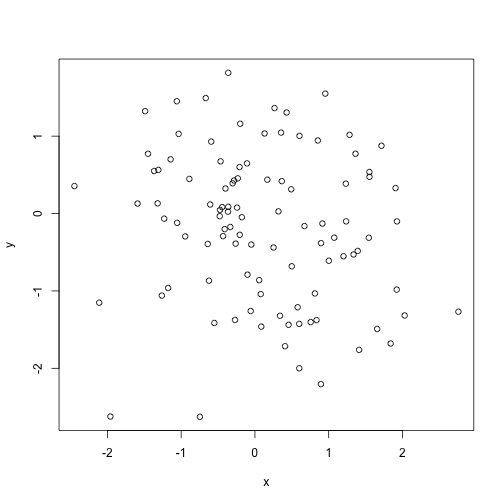
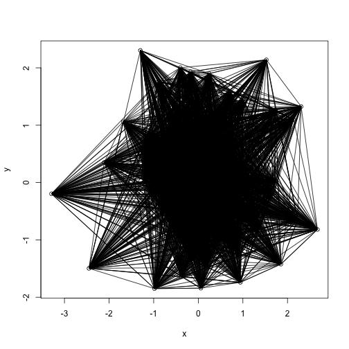

Simmulate a social network 
1a for i in 1,…,n respondents simulate a position in a 2-dimensional space 
using a draw from a 2d normal distribution

```r
rm(list = ls())
setwd('/Users/yuezhou/Desktop/TYLER')
n <- 100
x <- rnorm(n, mean = 0, sd = 1)
y <- rnorm(n, mean= 0, sd = 1)
plot(x, y)
```

 
#1b compute the n*n matrix of Euclidean distances between individuals 

```r
A <- cbind(x, y)
distance <- dist(A)
distance <- as.matrix(distance)
```
For each pair of individuals (say individual i and individual j), 
simulate an edge using a draw from a bernoulli distribution with a success probability 
equal to exp(a*d_ij)/(1+exp(a*d_ij)) where d_ij is the distance between i and j computed in 1b 
and a is a constant that controls the overall expected tie frequency. 

```r
a = 0.1
probability <- exp(a * distance)/ (1+exp(a*distance))
rvariable <- rbinom(n*n, 1, as.vector(probability))
rvariable = matrix(rvariable, ncol = n, nrow = n)
plot(x, y)
for(i in 1:n){
  for(j in 1:n){
    if (rvariable[i, j] == 1){
    segments(x[i],y[i],x[j],y[j])
    }
  }
}
```

 
Simulate covariates for each individual in the network 
2a simulate each individual’s age and gender 
by taking a draw from a distribution that looks like the us population age distribution 
and flipping a fair coin, respectively. 

```r
age <- runif(n, min = 0, max =100)
gender <- rbinom(n, 1, 1/2)
```
2b Now simulate an outcome for each person. 
Take a draw from a standard normal with mean equal to beta0+beta1*gender+beta2*age.

```r
beta0 <- 10
beta1 <- 10
beta2 <- 10
dontknow <- rnorm(n, mean = beta0 + beta1*gender + beta2*age, sd = 1)
```
Take a sample and compute a confidence interval
3a Randomly choosing a set of individuals 
then running a regression model to estimate beta1 and beta2. 

```r
index <-1:length(dontknow)
m <- 50 
somesample <- sample(index, m, replace=FALSE, prob = NULL)
dontknow[somesample]
```

```
##  [1] 263.46173 542.15419 506.40740 554.78892 299.68040 164.25693 221.71577
##  [8] 168.58070  29.59914 372.05855 920.50965 201.33132 853.51180 874.93014
## [15] 185.49694  34.15143 701.20360 866.13312 354.29174 575.13083 184.56040
## [22] 565.79240 991.49664  47.42585 113.19425  57.68100 394.85147 855.64440
## [29] 234.60219 628.94045 541.48937 353.45369 230.03913 737.47696 359.50144
## [36] 520.11367 903.72275 740.43407 101.18904 229.04207 366.78637 812.66503
## [43]  41.31415 248.92915 569.04290  72.15697 449.88599 544.77175 766.16273
## [50] 103.23741
```

```r
reg <- lm(dontknow[somesample] ~ age[somesample] + gender[somesample])
reg
```

```
## 
## Call:
## lm(formula = dontknow[somesample] ~ age[somesample] + gender[somesample])
## 
## Coefficients:
##        (Intercept)     age[somesample]  gender[somesample]  
##              10.03               10.00               10.09
```

```r
summary(reg)
```

```
## 
## Call:
## lm(formula = dontknow[somesample] ~ age[somesample] + gender[somesample])
## 
## Residuals:
##      Min       1Q   Median       3Q      Max 
## -2.76147 -0.81079  0.02082  1.06987  2.75747 
## 
## Coefficients:
##                    Estimate Std. Error t value Pr(>|t|)    
## (Intercept)        10.03472    0.39746   25.25   <2e-16 ***
## age[somesample]    10.00018    0.00653 1531.38   <2e-16 ***
## gender[somesample] 10.08912    0.37180   27.14   <2e-16 ***
## ---
## Signif. codes:  0 '***' 0.001 '**' 0.01 '*' 0.05 '.' 0.1 ' ' 1
## 
## Residual standard error: 1.268 on 47 degrees of freedom
## Multiple R-squared:      1,	Adjusted R-squared:      1 
## F-statistic: 1.241e+06 on 2 and 47 DF,  p-value: < 2.2e-16
```
Check if the confidence interval contains the true values of beta1 and beta2.

```r
confint(reg, "(Intercept)")
```

```
##                2.5 %   97.5 %
## (Intercept) 9.235131 10.83431
```

```r
confint(reg, "age[somesample]")
```

```
##                    2.5 %   97.5 %
## age[somesample] 9.987038 10.01331
```

```r
confint(reg, "gender[somesample]")
```

```
##                       2.5 %   97.5 %
## gender[somesample] 9.341162 10.83708
```
Yes the confidence interval contains the true value of beta1 and beta 2

3b Now randomly sample *edges* from the social network
and evaluate in the same way as 3b.  
After doing this multiple times compute the coverage of the confidence intervals

```r
trials <- 100
countbeta1 <- 0
countbeta2 <- 0
index <-1:length(dontknow)
m <- 50 
for(i in 1:trials){
  somesample <- sample(index, m, replace=FALSE, prob = NULL)
  reg <- lm(dontknow[somesample] ~ age[somesample] + gender[somesample])
  summary(reg)
  interval1 = confint(reg, "age[somesample]")
  interval2 = confint(reg, "gender[somesample]")
  if (beta1 < interval1[2] && beta1 > interval1[1]) {
    countbeta1 <- countbeta1 + 1
  }
  if (beta2 < interval2[2] && beta2 > interval2[1]) {
    countbeta2 <- countbeta2 + 1
  }
}
countbeta1
```

```
## [1] 99
```

```r
countbeta2
```

```
## [1] 99
```
After computing a hundred times, 
the fraction of times the true parameter beta1
is contained in the estimated interval is around 99/100
and the fraction of times the true parameter beta2
is contained in the estimated interval is around 60/100
```
